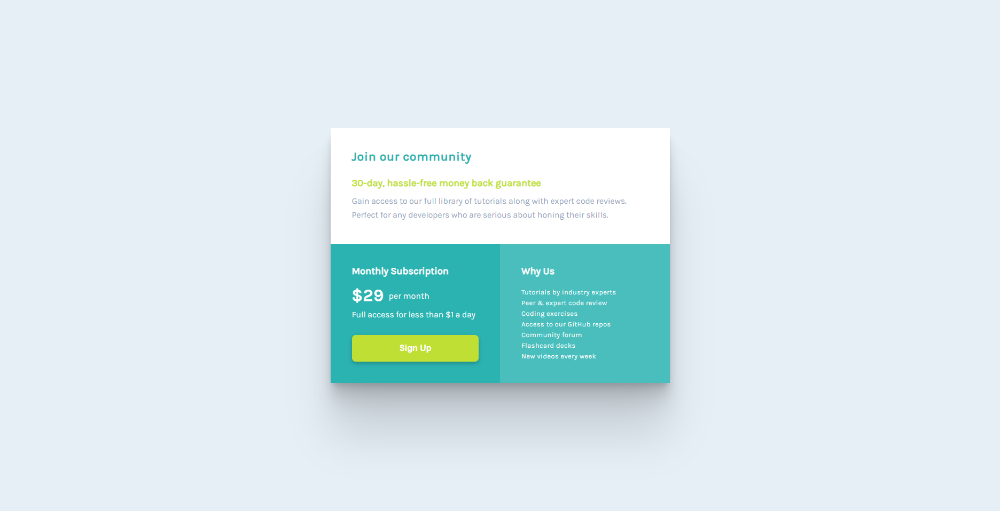

# Frontend Mentor - Single price grid component solution

This is a solution to the [Single price grid component challenge on Frontend Mentor](https://www.frontendmentor.io/challenges/single-price-grid-component-5ce41129d0ff452fec5abbbc). Frontend Mentor challenges help you improve your coding skills by building realistic projects.

## Table of contents

- [Overview](#overview)
  - [The challenge](#the-challenge)
  - [Screenshot](#screenshot)
  - [Links](#links)
- [My process](#my-process)
  - [Built with](#built-with)
  - [What I learned](#what-i-learned)
  - [Continued development](#continued-development)
- [Author](#author)

## Overview

### The challenge

Users should be able to:

- View the optimal layout for the component depending on their device's screen size
- Using a flexbox for desktop and mobile devices

### Screenshot

    

      
      
    

### Links

- Solution URL: [Frontend Mentor](https://www.frontendmentor.io/solutions/single-price-grid-component-solution-WPNrwpkrZ9)
- Live Site URL: [Vercel](https://single-price-grid-component-challenge-brown.vercel.app/)

## My process

### Built with

- Semantic HTML5 markup
- CSS custom properties
- Flexbox
- Box Model and Styling

**Note: These are just examples. Delete this note and replace the list above with your own choices**

### What I learned

1. **Flexbox Layout**: The CSS code extensively uses Flexbox layout properties to create responsive and flexible designs. The display: flex property is used on the .card-holder, .card, .bot-card, .subscription, and .why-us elements to create flexible containers. Flexbox properties like justify-content, align-items, and flex-direction are utilized to control the alignment and positioning of the elements.

2. **CSS Variables**: The :root selector is used to define CSS variables, which are then used throughout the code to set color values. Variables like --cyan, --bright-yellow, --light-gray, --grayish-blue, and --darkish-cyan are defined and referenced in various places to maintain consistency and facilitate easy color theme customization.

3. **Box Model and Styling**: The CSS code demonstrates the usage of the box model by setting margin, padding, and border-radius. The box-sizing: border-box property ensures that the padding and border values are included within the specified width and height, making it easier to calculate the size of elements. The box-shadow property is used to add a subtle shadow effect to the .card element.

### Continued development

As my CSS codebase grows, it's important to maintain a well-organized and modular structure. Maybe I will consider using a CSS preprocessor like Sass or LESS to leverage features like variables, mixins, and nested rules, which can improve code readability and maintainability. Additionally, I want to explore methodologies like BEM (Block Element Modifier) or SMACSS (Scalable and Modular Architecture for CSS) to better structure my CSS code.

## Author

- GitHub - [Lekka Audisy](https://github.com/lekkaaudisy)
- Frontend Mentor - [@lekkaaudisy](https://www.frontendmentor.io/profile/lekkaaudisy)
- Twitter - [@la_ramadhana](https://www.twitter.com/la_ramadhana)
